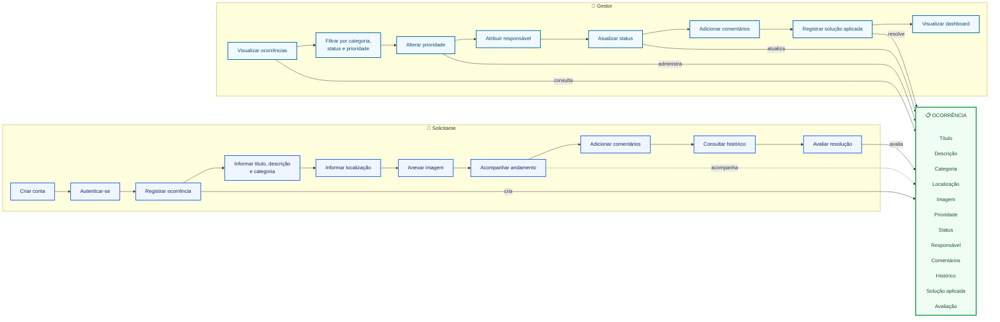
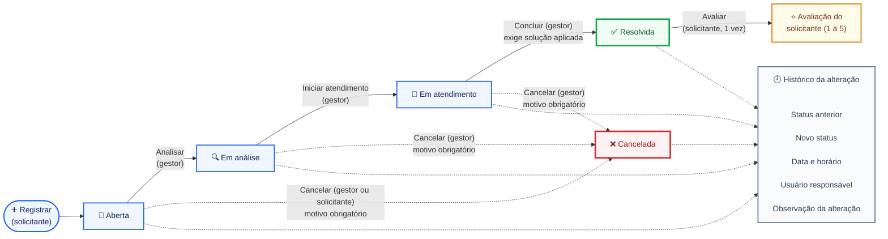

# 2. Fluxos

## 2.1 Perfis de usuário e ocorrência

Capacidades de cada perfil e como se relacionam com a ocorrência. As setas dentro de cada perfil indicam a jornada típica — após o registro, acompanhar, comentar e consultar o histórico podem acontecer em qualquer ordem.

## 2.2 Ciclo de vida da ocorrência

Estados, transições permitidas (com quem pode executá-las e suas pré-condições) e o registro de histórico gerado em cada mudança. Regras detalhadas em [Regras de negócio](01-descoberta-do-dominio.md#16-regras-de-negócio).

**Resumo das regras do ciclo:**

- Não é possível pular etapas (ex.: Aberta → Resolvida é rejeitada).
- Resolvida e Cancelada são estados finais.
- O histórico registra também a criação (sem status anterior → Aberta).
- Mudanças simultâneas de status: só a primeira é aplicada; a segunda recebe conflito (HTTP 409).

## 2.3 Sequência do fluxo principal

Como as camadas do sistema colaboram do registro à avaliação.

```mermaid
sequenceDiagram
    autonumber
    actor S as Solicitante
    actor G as Gestor
    participant W as Frontend (React)
    participant A as API (Go)
    participant DB as PostgreSQL

    S->>W: Preenche nova ocorrência (+ imagem)
    W->>A: POST /api/occurrences
    A->>DB: INSERT occurrence + INSERT status_history (∅ → aberta)
    A-->>W: 201 Ocorrência #id
    W->>A: POST /api/occurrences/{id}/image
    A->>DB: INSERT files · UPDATE image_url

    G->>W: Filtra, prioriza e atribui
    W->>A: PATCH /priority · PATCH /assignee
    G->>W: Avança o status
    W->>A: PATCH /status {em_analise → em_atendimento}
    A->>DB: UPDATE status (se ainda for o anterior) + INSERT status_history

    G->>W: Registra solução e resolve
    W->>A: PATCH /status {resolvida, solution}
    A->>DB: UPDATE status, solution, resolved_at + INSERT status_history

    S->>W: Consulta histórico e avalia
    W->>A: POST /api/occurrences/{id}/rating {1..5}
    A->>DB: UPDATE rating (somente se ainda não avaliada)
    A-->>W: 200 Ocorrência avaliada
```

