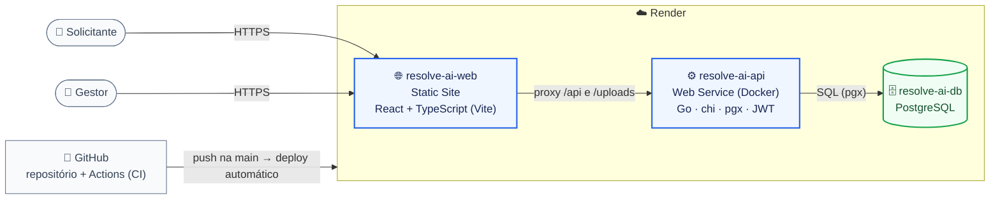
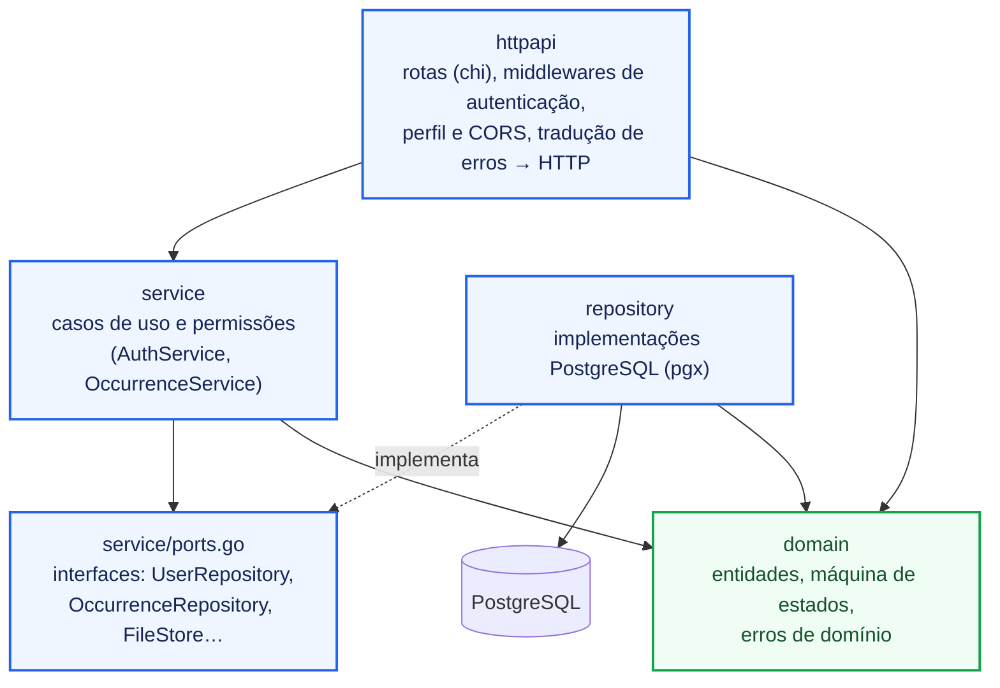
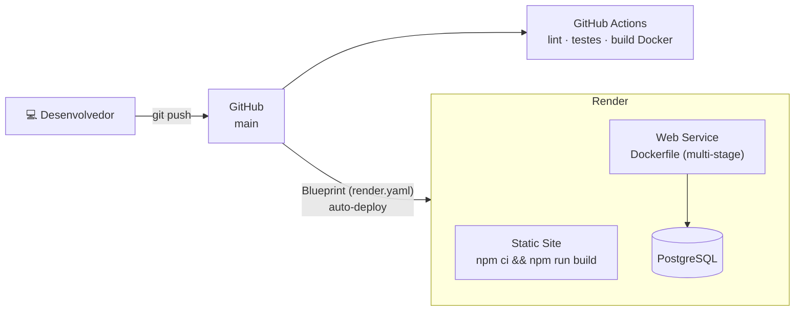

# 3. Arquitetura

## 3.1 Visão de containers

O navegador conversa apenas com o domínio do frontend; o Render encaminha `/api/*` e `/uploads/*` para a API. Com isso o frontend usa URLs relativas e não há CORS em produção.

## 3.2 Camadas do backend

Arquitetura em camadas com dependências apontando para o domínio. Os serviços dependem de **interfaces** (portas), implementadas pelos repositórios PostgreSQL — o que permite testar toda a regra de negócio com implementações em memória, sem banco.

| Pacote | Responsabilidade |
|--------|------------------|
| `cmd/api` | Composição: lê configuração, conecta ao banco, roda migrações, cria o gestor inicial e sobe o servidor HTTP com *graceful shutdown* |
| `internal/domain` | Entidades, `Status` com as transições permitidas, erros de domínio |
| `internal/service` | Regras de negócio (RN-01 a RN-13) e autorização por perfil |
| `internal/repository` | SQL; transações para mudança de status + histórico |
| `internal/httpapi` | HTTP: roteamento, autenticação JWT, validação de entrada, mapeamento de erros |
| `internal/database` | Pool de conexões e migrações SQL embutidas no binário |

**Frontend** (`frontend/src`): `lib/` (cliente da API, tipos, regras de transição espelhadas), `auth/` (contexto de sessão), `components/` e `pages/` (Login, Cadastro, Lista, Nova ocorrência, Detalhe, Dashboard).

## 3.3 Deploy

A infraestrutura é declarada em [`render.yaml`](../render.yaml) (*infrastructure as code*): banco, API e frontend são criados e atualizados a partir do repositório. As migrações rodam automaticamente na subida da API.

## 3.4 Decisões de arquitetura (ADRs)

| # | Decisão | Motivo | Alternativas consideradas |
|---|---------|--------|---------------------------|
| ADR-01 | **Monorepo** com `backend/` e `frontend/` | Uma única fonte de verdade para código, CI, Docker Compose e Blueprint de deploy | Repositórios separados (mais coordenação entre versões) |
| ADR-02 | **Go** no backend | Binário único e pequeno, ótimo desempenho com pouca memória (bom para o plano free), tipagem estática e biblioteca padrão forte para HTTP | Node.js, Java/Spring |
| ADR-03 | **PostgreSQL** | Relacional com transações ACID — essencial para o histórico auditável — e restrições (`CHECK`, FKs) que reforçam as regras no próprio banco | MongoDB (sem transações simples entre coleções no MVP) |
| ADR-04 | **Arquitetura em camadas com portas (interfaces)** | Regras de negócio independentes de HTTP e SQL, testáveis com fakes em memória | MVC acoplado ao ORM |
| ADR-05 | **SQL explícito com pgx**, sem ORM | Controle total das consultas (joins, agregações do dashboard, controle otimista) | GORM |
| ADR-06 | **JWT stateless** | Sem sessão no servidor; escala horizontalmente e simplifica o deploy | Sessões com cookie + armazenamento |
| ADR-07 | **Histórico na mesma transação** da mudança de status + **controle otimista** (`WHERE status = anterior`) | Garante que nenhuma mudança fique sem histórico e que alterações concorrentes não se sobreponham | Triggers no banco; *locks* pessimistas |
| ADR-08 | **Imagens armazenadas no PostgreSQL** (`files`) | O disco dos serviços free do Render é efêmero; guardar no banco dispensa volume e serviço extra no MVP | Object storage (S3/GCS) — evolução natural via a interface `FileStore` |
| ADR-09 | **Render** com Blueprint | Deploy gratuito de banco + Docker + site estático a partir do GitHub, com infraestrutura como código | AWS/GCP (mais configuração), Railway, Fly.io |
| ADR-10 | **React + Vite + TypeScript** sem biblioteca de UI | Build rápido, tipagem compartilhada com os contratos da API, bundle enxuto | Next.js, Material UI |

## 3.5 Evoluções futuras

- Object storage (S3/GCS) para imagens, trocando a implementação de `FileStore`.
- Notificações (e-mail/push) a cada mudança de status.
- Múltiplas organizações (condomínios/empresas) no mesmo sistema.
- SLA por prioridade e alertas de atraso no dashboard.
- Documentação OpenAPI/Swagger da API.
