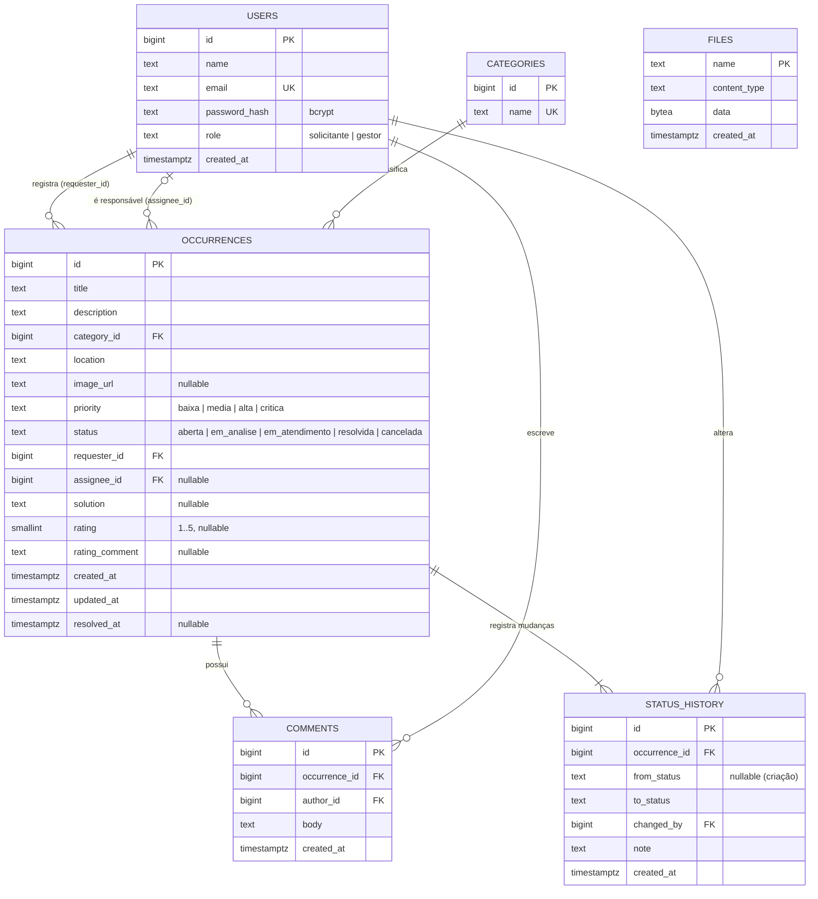

# 4. Modelo de dados

Esquema definido nas migrações em [`backend/internal/database/migrations`](../backend/internal/database/migrations), aplicadas automaticamente na subida da API.

## Dicionário de dados

| Tabela | Finalidade | Observações |
|--------|------------|-------------|
| `users` | Solicitantes e gestores | E-mail único; senha só como hash bcrypt; `role` restrito por `CHECK` |
| `categories` | Categorias de ocorrência | Semeada com as 8 categorias do domínio |
| `occurrences` | Objeto central | `status` e `priority` restritos por `CHECK`; `rating` entre 1 e 5; `resolved_at` preenchido ao resolver (usado no tempo médio de resolução) |
| `comments` | Conversa na ocorrência | Removidos em cascata com a ocorrência |
| `status_history` | Auditoria de mudanças de status | Uma linha por transição (inclusive a criação, com `from_status` nulo); gravada na mesma transação da mudança |
| `files` | Imagens anexadas | Servidas em `/uploads/<name>`; `occurrences.image_url` aponta para elas |
| `schema_migrations` | Controle de migrações | Versões já aplicadas |

**Índices:** `occurrences(requester_id)`, `(status)`, `(category_id)`, `(priority)` para os filtros da listagem; `comments(occurrence_id)` e `status_history(occurrence_id)` para o detalhe.
