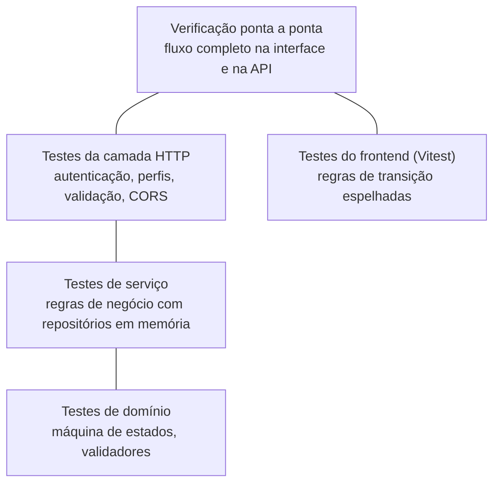

# 5. Qualidade e testes

## 5.1 Estratégia



| Nível | Onde | O que cobre |
|-------|------|-------------|
| Domínio | `backend/internal/domain/status_test.go` | Todas as transições válidas e inválidas; estados finais; validação de status e prioridade |
| Serviço | `backend/internal/service/*_test.go` | RN-01 a RN-12: criação e validação, visibilidade por perfil, ciclo completo com histórico, transições inválidas, cancelamento pelo solicitante, operações exclusivas do gestor, avaliação, upload, comentários, cadastro/login/token |
| HTTP | `backend/internal/httpapi/router_test.go` | Rotas públicas × protegidas, token inválido, restrição por perfil (403), parâmetros inválidos (400), preflight CORS |
| Frontend | `frontend/src/lib/labels.test.ts` | Transições disponíveis por perfil, estados finais |

Os testes de serviço usam implementações em memória das interfaces de repositório (`fakes_test.go`), por isso rodam em milissegundos e sem banco.

## 5.2 Integração contínua

O workflow [`.github/workflows/ci.yml`](../.github/workflows/ci.yml) roda a cada push e pull request:

1. **backend** — `go vet` e `go test -race`
2. **frontend** — `oxlint`, `vitest` e build de produção (inclui checagem de tipos)
3. **docker** — build das imagens do `docker-compose.yml`

O deploy no Render acontece automaticamente a cada push na `main`.

## 5.3 Verificações ponta a ponta realizadas

Contra um PostgreSQL real (API executando localmente):

- Cadastro, e-mail duplicado (409), login do gestor.
- Criação de ocorrência, upload de imagem e download idêntico em `/uploads/…`; arquivo inexistente → 404.
- Filtros por status, prioridade, categoria e busca com acentuação.
- Dashboard bloqueado para solicitante (403).
- Prioridade, atribuição, transição inválida (422), ciclo Aberta → Em análise → Em atendimento → Resolvida.
- Histórico com 4 registros (criação + 3 transições), cada um com o usuário correto.
- Comentário, avaliação, dashboard com indicadores.
- Cancelamento pelo solicitante sem motivo (422) e com motivo (200).

Pela interface (navegador, ambiente local com PostgreSQL real):

- Cadastro de solicitante com login automático; lista vazia com chamada para registrar.
- Nova ocorrência com imagem (pré-visualização antes do envio) → detalhe com status Aberta e histórico inicial.
- Comentário do solicitante; opção de cancelar visível apenas enquanto Aberta.
- Gestor: painel de gestão, prioridade Alta, atribuição de responsável, Aberta → Em análise → Em atendimento com observações.
- Tentativa de resolver sem solução: aviso na tela e recusa da API; solução registrada → Resolvida; painel de gestão some (estado final).
- Linha do tempo com 4 registros (status anterior → novo, data/hora, usuário, observação).
- Solicitante vê a solução aplicada e avalia com 4 estrelas + comentário; formulário substituído pela avaliação registrada.
- Dashboard: totais, tempo médio de resolução, satisfação média (4.0 / 5), distribuição por status, prioridade e categoria.

Em produção (Render):

- `GET /api/health` via proxy do frontend → 200.
- Login inválido → 401 com mensagem da API (confirma a conexão API ↔ banco).
- Rota protegida sem token → 401.
- Rotas do SPA (ex.: `/ocorrencias/1`) servidas pelo `index.html`.

## 5.4 Como executar

```bash
cd backend  && go test ./...
cd frontend && npm test
```
